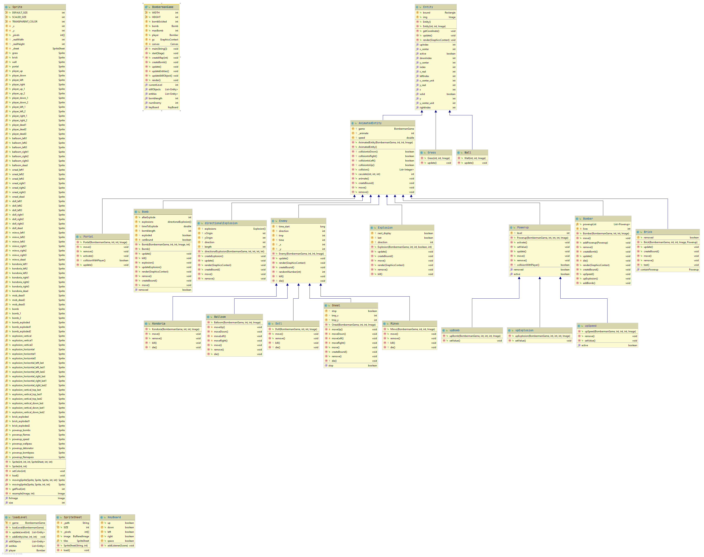

# Bài tập lớn OOP - Bomberman Game
Video Demo:
https://drive.google.com/file/d/1x84FVHxjE0l2NwXrOJUbqvI5ZGMpXEnw/view?usp=sharing

Diagram: Diagram.png

Mô tả:
Mô tả Bomberman
Nhóm thực hành 2 – Nhóm 4
Thành viên:
-	Trần Thanh Trà
-	Nguyễn Như Duy

•	  Bomber là nhân vật chính của trò chơi. Bomber có thể di chuyển theo 4 hướng trái/phải/lên/xuống theo sự điều khiển của người chơi.
•	    Enemy là các đối tượng mà Bomber phải tiêu diệt hết để có thể qua Level. Enemy có thể di chuyển ngẫu nhiên hoặc tự đuổi theo Bomber tùy theo loại Enemy. Các loại Enemy sẽ được mô tả cụ thể ở phần dưới.
•	  Bomb là đối tượng mà Bomber sẽ đặt và kích hoạt tại các ô Grass. Khi đã được kích hoạt, Bomber và Enemy không thể di chuyển vào vị trí Bomb.
•	Grass là đối tượng mà Bomber và Enemy có thể di chuyển xuyên qua, và cho phép đặt Bomb lên vị trí của nó
•	  Wall là đối tượng cố định, không thể phá hủy bằng Bomb cũng như không thể đặt Bomb lên được, Bomber và Enemy không thể di chuyển vào đối tượng này
•	  Brick là đối tượng được đặt lên các ô Grass, không cho phép đặt Bomb lên nhưng có thể bị phá hủy bởi Bomb được đặt gần đó. Bomber và Enemy thông thường không thể di chuyển vào vị trí Brick khi nó chưa bị phá hủy.
•	  Portal là đối tượng được giấu phía sau một đối tượng Brick. Khi Brick đó bị phá hủy, Portal sẽ hiện ra và nếu tất cả Enemy đã bị tiêu diệt thì người chơi có thể qua Level khác bằng cách di chuyển vào vị trí của Portal.
Các Item cũng được giấu phía sau Brick và chỉ hiện ra khi Brick bị phá hủy. Bomber có thể sử dụng Item bằng cách di chuyển vào vị trí của Item. Thông tin về chức năng của các Item được liệt kê như dưới đây:
•	  SpeedItem Khi sử dụng Item này, Bomber sẽ được tăng vận tốc di chuyển thêm một giá trị thích hợp
•	  FlameItem Item này giúp tăng phạm vi ảnh hưởng của Bomb khi nổ (độ dài các Flame lớn hơn)
•	  BombItem Thông thường, nếu không có đối tượng Bomb nào đang trong trạng thái kích hoạt, Bomber sẽ được đặt và kích hoạt duy nhất một đối tượng Bomb. Item này giúp tăng số lượng Bomb có thể đặt
Có nhiều loại Enemy trong Bomberman, tuy nhiên trong phiên bản này chỉ yêu cầu cài đặt hai loại Enemy dưới đây (nếu cài đặt thêm các loại khác sẽ được cộng thêm điểm):
•	  Balloom là Enemy đơn giản nhất, di chuyển ngẫu nhiên với vận tốc cố định
•	  Oneal có tốc độ di chuyển thay đổi, lúc nhanh, lúc chậm và di chuyển "thông minh" hơn so với Balloom (biết đuổi theo Bomber)
Mô tả game play, xử lý va chạm và xử lý bom nổ
•	Trong một màn chơi, Bomber sẽ được người chơi di chuyển, đặt và kích hoạt Bomb với mục tiêu chính là tiêu diệt tất cả Enemy 
•	Bomber sẽ bị giết khi va chạm với Enemy hoặc thuộc phạm vi Bomb nổ. Lúc đấy trò chơi kết thúc.
•	Enemy bị tiêu diệt khi thuộc phạm vi Bomb nổ
•	Một đối tượng thuộc phạm vi Bomb nổ có nghĩa là đối tượng đó va chạm với một trong các tia lửa được tạo ra tại thời điểm một đối tượng Bomb nổ.
•	Khi Bomb nổ, một Flame trung tâm  tại vị trí Bomb nổ và bốn Flame tại bốn vị trí ô đơn vị xung quanh vị trí của Bomb xuất hiện theo bốn hướng trên dưới,trái,phải. Độ dài bốn Flame xung quanh mặc định là 1 đơn vị, được tăng lên khi Bomber sử dụng các FlameItem.
•	Khi các Flame xuất hiện, nếu có một đối tượng thuộc loại Brick/Wall nằm trên vị trí một trong các Flame thì độ dài Flame đó sẽ được giảm đi để sao cho Flame chỉ xuất hiện đến vị trí đối tượng Brick/Wall theo hướng xuất hiện. 
